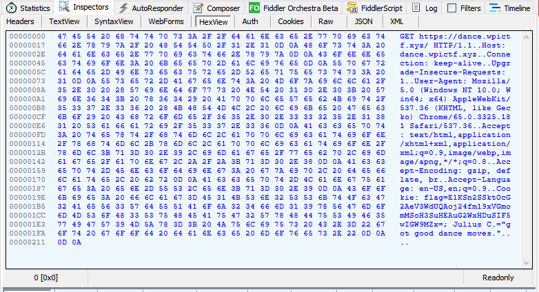
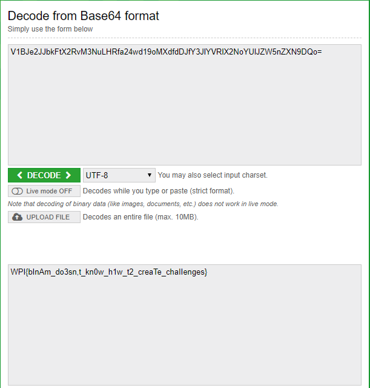

# WPICTF 2018: Dance

**Category:** Web (?)
**Points:** 150

> https://dance.wpictf.xyz
> 
> by binam
> 

## Write-up

When accessing the URL using a standard browser, it will redirect to a classic youtube link:

[Link](https://www.youtube.com/watch?v=dQw4w9WgXcQ#t=0m09s)

Not much to work with right now. Considering it is web, I didnt really look at the video much (it was also the original).

The first thing I decided to look at was what was being sent so I used [Fiddler](https://www.telerik.com/fiddler) to help me out here. The WebView of the site doesnt reveal anything but that it should be redirected to the link mentioned already.

Looking into the header I see that some Cookies were set:

**flag=e1ksn2ssktocg2aev3wduqaoj24fm19xvgmommsoh3suheaug2wxhdusif5wigw9mzx= **
**Julius C.="got good dance moves."**

Wow. This seems too easy to be true. That *flag* seems like it is a base64 encoded string, so I tried decoding it right away. To my somehow enjoyment it didnt work, so I assumed there is a layer on top of it. 

The other cookie seem like a clue. I noticed right away that it is probably talking about Julius *Caesar*, leading me to believe that the encoded string probably was shifted. 

The question at this point was, it was shifted, but *by how much?*

After a while looking for anything within the site, I noticed that the link given had a time where it started at **9 seconds**. I took that as the sign I needed if this was going to work, and used normal Caesar Cipher to try and shift it back to the original and then decode it with base64.

To my surprise (as I thought I was there), it did not work. 

However after a while reading about Caesar Cipher, I found out there is also ROT13 that is a special case of Caesar Cipher with a specific shift value. So I shifted the string using ROT13, n = 9, and when I decoded it with base64, alas, got the flag:

**WPI{bInAm_do3sn,t_kn0w_h1w_t2_creaTe_chaIIenges}**
